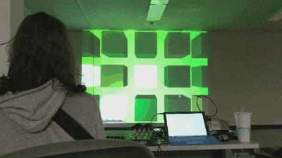

# MIDI Experiment
### Music Visualizer + Triggers

An experiment in having visualizations being MIDI and sound controlled from the hosts computer and MIDI devices connected to it.

### Setup / Usage

1. Install [`npm`](https://nodejs.org/en/download/) (comes with node).
2. Clone this repository
3. Run `npm install`
4. Run `node_modules\.bin\webpack-dev-server` (hosts the server on your `localhost:8080`)
5. Run `node_modules\.bin\gulp` (build + file watching)

OUT OF DATE:
Normal users can check out [The MIDI Experiment Firebase App](https://midi-experiment.firebaseapp.com/) for a semi-latest version of the application